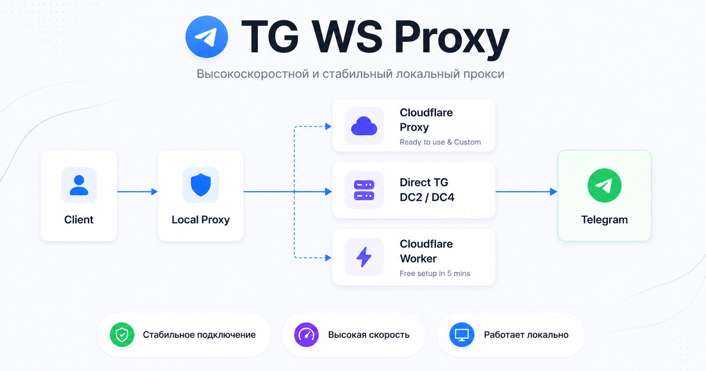
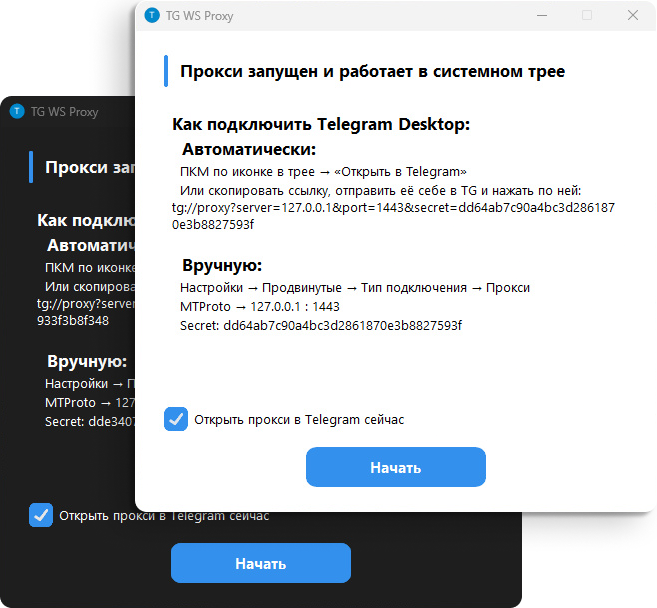

<div align="center">

**[🇷🇺 Русский](../README.md) • 🇬🇧 English**

</div>

<div align="center">
	<br />
	<p>
		
	</p>
</div>

##

> [!TIP]
>
> ### [🎉 Support Me](../EN/Funding.md)
>
> **USDT (TRC20)**: `TXPnKs2Ww1RD8JN6nChFUVmi5r2hqrWjuu`  
> **BTC**: `bc1qr8vd6jelkyyry3m4mq6z5txdx4pl856fu6ss0w`  
> **ETH**: `0x1417878fdc5047E670a77748B34819b9A49C72F1`  
> **Other coins**: https://nowpayments.io/donation/flowseal

> [!CAUTION]
>
> ### Antivirus Detection
>
> Antivirus software sometimes incorrectly marks the application as a virus due to the packer.  
> If you cannot download due to antivirus blocking, then:
>
> 1) **Try downloading the Windows 7 version (functionally identical)**
> 2) Temporarily disable antivirus during download, add the file to exclusions, then re-enable  
>
> Always verify what you download from the internet, especially from untrusted sources. It's best to check detections from well-known antivirus vendors on VirusTotal.

# TG WS Proxy

**Local MTProto proxy** for Telegram Desktop that **speeds up Telegram**, redirecting traffic through WebSocket connections. Data is transmitted in the same encrypted form, and no external servers are needed.

<picture>
  <source srcset="../images/preview-dark.png" media="(prefers-color-scheme: dark)">
  
</picture>

## Navigation

- **🚀 Quick Start**
  - **[Windows](./README.windows.md)**
  - **[macOS](./README.macos.md)**
  - **[Linux](./README.linux.md)**
  - **[Docker](./README.docker.md)**
- [Cloudflare Worker Setup (free alternative to CF proxy)](./CfWorker.md)
- [Cloudflare Domain Setup (CF proxy)](./CfProxy.md)
- [Telegram Test Environment (Test DCs)](./TestDc.md)
- [Fake TLS + upstream in Nginx](./FakeTlsNginx.md)
- [Tray Application Configuration Files](./TrayConfig.md)
- [Building from Source](./BuildFromSource.md)
- [Contributor Guide](./CONTRIBUTING.md)

## Windows: Quick Start

Go to the [releases page](https://github.com/Flowseal/tg-ws-proxy/releases) and download:

- `TgWsProxy_windows.exe` (Windows 10+ x64)
- `TgWsProxy_windows_arm64.exe` (Windows 10+ ARM64)
- `TgWsProxy_windows_7_64bit.exe` (Windows 7 x64)
- `TgWsProxy_windows_7_32bit.exe` (Windows 7 x32)

On first launch, a window will open with instructions for connecting Telegram Desktop. **The application minimizes to system tray.**

### Tray Menu

- **Open in Telegram** — automatically configure proxy via `tg://proxy` link
- **Copy Link** — copy the proxy connection link
- **Restart Proxy** — restart without exiting the application
- **Settings...** — GUI configuration editor (app version, optional GitHub update checks)
- **Open Logs** — open log file
- **Exit** — stop proxy and close application

### Configuring Telegram Desktop

**Automatic Setup**

Right-click the tray icon and select **"Open in Telegram"**.

If it doesn't work (Telegram doesn't open with proxy), follow these steps:

1. Right-click the tray icon and select **"Copy Link"**
2. Send the link to "Saved Messages" in Telegram and click it
3. Connect

**Manual Setup**

1. Telegram → **Settings** → **Advanced** → **Connection type** → **Proxy**
2. Add proxy:
   - **Type:** MTProto
   - **Server:** `127.0.0.1` (or your custom address)
   - **Port:** `1443` (or your custom port)
   - **Secret:** from settings or logs

## How It Works

```
Telegram Desktop → MTProto Proxy (127.0.0.1:1443) → WebSocket → Telegram DC
```

1. Application starts MTProto proxy on `127.0.0.1:1443`
2. Intercepts connections to Telegram IP addresses
3. Extracts DC ID from MTProto obfuscation init packet
4. Establishes WebSocket connection (TLS) to corresponding DC via Telegram domains
5. If WS unavailable (302 redirect) — automatically switches to CfProxy / direct TCP connection

> [!IMPORTANT] 
> ### Photos/Videos Not Loading?
> **In proxy settings, leave only `4:149.154.167.220` in DC → IP**  
> **If that doesn't work, clear the field completely**  
> This issue occurs on non-Premium accounts  
> If still not working, set up your own domain following: [CfProxy.md](./CfProxy.md)

## Automatic Build

The project contains PyInstaller specs ([`packaging/windows.spec`](../../packaging/windows.spec), [`packaging/macos.spec`](../../packaging/macos.spec), [`packaging/linux.spec`](../../packaging/linux.spec)) and GitHub Actions workflow ([`.github/workflows/build.yml`](../../.github/workflows/build.yml)) for automated builds.

Minimum supported OS versions for current binary builds:

- Windows 10+ x64 for `TgWsProxy_windows.exe`
- Windows 10+ ARM64 for `TgWsProxy_windows_arm64.exe`
- Windows 7 (x64) for `TgWsProxy_windows_7_64bit.exe`
- Windows 7 (x32) for `TgWsProxy_windows_7_32bit.exe`
- Intel macOS 10.15+
- Apple Silicon macOS 11.0+
- Linux x86_64 (AppIndicator required for system tray)

## Contributors

Thanks to everyone who helps develop this project ❤️

<a href="https://github.com/Flowseal/tg-ws-proxy/graphs/contributors">
  
</a>

## License

[MIT License](../../LICENSE)
